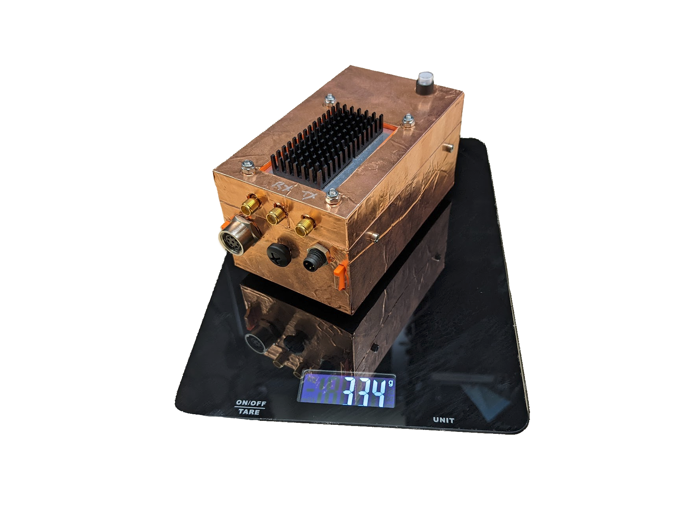
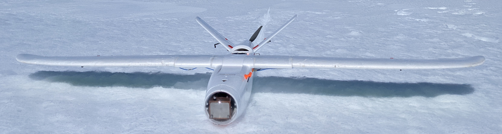

# Peregrine Hardware FIles

This repository contains hardware design and fabrication files for the Peregrine UAV-borne radio echo sounder (Part of the ORCA project)

See https://orca.radioglaciology.com/docs/peregrine/ for details

Design files produced by us are available under an [MIT License](LICENSE). For vendor CAD, please check with individual vendors.

## Payload Enclosure

The payload enclosure is the box containing the Ettus b205-mini SDR and the Raspberry Pi for the Peregrine UAS.

This assembly normally lives in the nosecone of the Peregrine UAV, as seen in the photo below, however it can be re-purpose in other ways.

