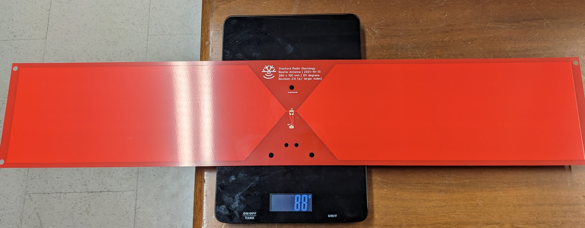
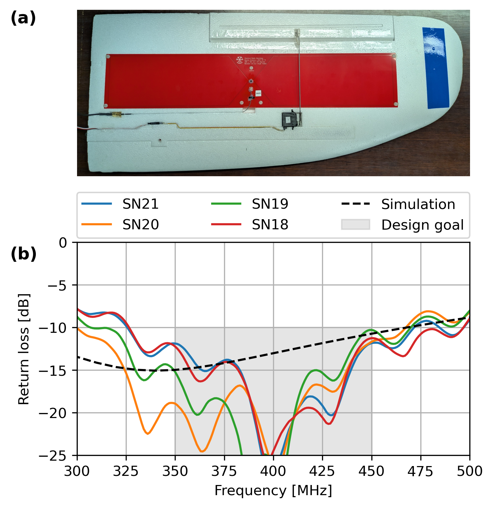

# Peregrine Underwing Edge-Cut Bowtie Antenna

This is the design for the edge-cut bowtie radar antennas mounted under the Peregrine wings.

The `.zip` file is an export from EasyEDA. It can be uploaded to EasyEDA as a new project. It is also possible to load in KiCAD using the EasyEDA importer (File > Import Non-KiCad Project ... > EasyEDA (JLCEDA) Std Backup).

The source project in EasyEDA is titled `bowtie-v2.6-with-larger-holes`.

## Production notes

This antenna is designed to be printed on standard FR4. FR4 is generally not controlled for dielectric permittivity, so results may vary and each individual unit should be checked for S11 before use.

The design is not particularly sensitive to the FR4 thickness. For Peregrine, I had this produced on 0.6 mm FR4 substrate, which significantly reduces the weight. Note that 0.6mm FR4 substrate is not ridgid on its own, which may be a downside depending on how you plan to use this.

The total width (588 mm) is larger than what many PCB manufacturers can do. We produced this PCB with PCBWay.

If you want to copy our settings exaclty, the design is shared on PCBWay: https://www.pcbway.com/project/shareproject/Peregrine_under_wing_bowtie_antenna_c198dc1e.html

## Bill of Materials

* U1 (balun): [Mini-Circuits TC4-1W+](https://www.minicircuits.com/WebStore/dashboard.html?model=TC4-1W%2B)
* RF1 (U.FL connector): [U.FL-R-SMT-1(40)](https://www.mouser.com/ProductDetail/Hirose-Connector/U.FL-R-SMT-140?qs=PABxe4V6HDrVNWAmh6WKgw%3D%3D&srsltid=AfmBOopH3k4K2ASrjq8ZP3SyGSTScw2wuCMmbPjLw4Hym1gIAsaXcrwh)
* Suggested U.FL to SMA cable: [CSI-SGFI-100-UFFR ](https://www.mouser.com/ProductDetail/TE-Connectivity-Linx-Technologies/CSI-SGFI-100-UFFR?qs=j%252B1pi9TdxUbVF8XdLr3HSg%3D%3D)
* Silicone adhesive: [EGS10C-20G](https://www.digikey.com/en/products/detail/chip-quik-inc/EGS10C-20G/10059587)