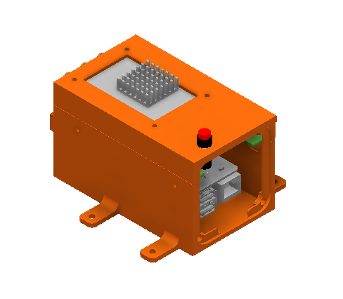
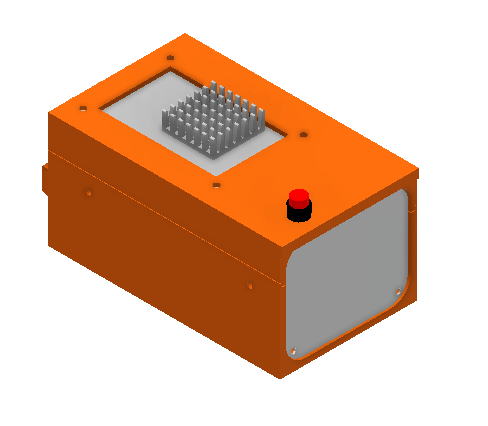

# Peregrine Payload Enclosure

This is the main radar payload enclosure for Peregrine.

See https://orca.radioglaciology.com/docs/peregrine/payload/ for details.

The `design_files` directory has STEP assembly files and Autodesk Inventor
[Pack and Go files](https://help.autodesk.com/view/INVNTOR/2025/ENU/?guid=GUID-730304AA-13BD-467B-9351-C7C1362876BD)
fpr each of the variants described below.

The `fabrication_files_(variant)` contain ready-to-use files for fabrication. See [fabrication notes](#fabrication) below.

## Variants

There are three variants included here:

### Pi 5

This version fits in the Peregrine nosecone and contains a Raspberry Pi 5.

This version is identical to the Pi 4 version except for an different heatsink design.

### Pi 5 with NVMe SSD

This is a variant of the above with the Pi-side of the shell vertically extended to make space for an NVMe SSD. See https://orca.radioglaciology.com/docs/peregrine/payload/data-storage/ for more information.

Note that because this is a vertically stretch version, it does not fit in the Peregrine nosecone without modification. This variant was designed for other uses and also has 4 mounting holes added on small tabs.

### Pi 4 (archived)

This version fits in the Peregrine nosecone and contains a Raspberry Pi 4.

For new builds, using the Raspberry Pi 5 is strongly recommended.

## Fabrication notes

### 3D Printing

The following components are intended to be 3D printed:

* `pi_shell.stl`
* `sdr_shell.stl`

They are designed for printing on an FDM printer. They should be printed in ASA
or a similar material (not PLA) to avoid warping due to the heat from the components
inside.

### Laser Cutting

The `cover_plate_2holes_standardfit_0p5mm_tolerance.dxf` file is intended for
laser cutting. Our default option is to cut this out of 1 mm (0.040") aluminum.
(We use SendCutSend's 5052 H32 Aluminum cutting service.)

For the Peregrine UAS, it can be useful to use this plate as a fine-tuning
adjustment for the center of gravity, since it sits in the very front of the
aircraft. For this purpose, our flight kit usually contains copies of this part
cut out of the following materials (all from SendCutSend):

* 1 mm 5052 Aluminum
* 1 mm Copper
* 1.5 mm Copper

This provides enough mass variation to be able to fine-tune the center of gravity
as needed.
(The adjustable battery tray provides the main center of gravity adjustment.
This is for minor fine-tuning only.)

### CNC Machining

The `pi(4/5)_heat_block.stp` and associated `pi(4/5)_heat_block.pdf` files are
intended for CNC machining. The PDF file is a drawing that specifies the thread
tapping needed for the mounting holes.

We get this fabricated out of aluminum. We have used several CNC vendors with
good results every time.