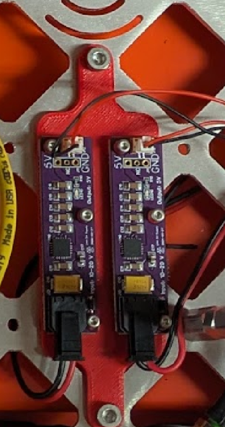

# 5V LNA Power Supply

**This PCBA is NOT a core Peregrine component. It is part of the "Peregrine+" ground-based system. It may be useful for various customized setups. It should not be used for high current applications such as UAV motors.**

This project contains two simple designs for relatively low noise 5V power supplies intended to be used for powering low noise amplifiers. One is intended to be paired with a switching power supply providing slightly over 5V (such as the switching 5V supply in this repo configured to provide 5.2 or 5.3V). The other is a fully linear path from 10-20V input directly. The version we've used more extensively is the one that goes directly from the 10-20V version.

The `.zip` file is an export from EasyEDA. It can be uploaded to EasyEDA as a new project. It is also possible to load in KiCAD using the EasyEDA importer (File > Import Non-KiCad Project ... > EasyEDA (JLCEDA) Std Backup).

The source project in EasyEDA is titled `5v-lna-supply`.

## Fabrication notes

The Gerber files, BOM, and Pick and Place files are in the [fabrication_files](fabrication_files/) subdirectory. I've produced this PCB with JLCPCB in the past, but there's nothing particularly unique about the requirements. Any board house should be able to do it.