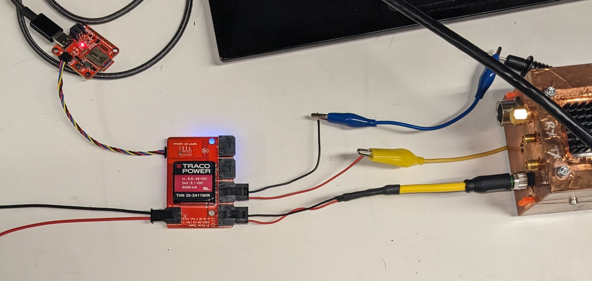

# 5V Power for Peregine Payload

This is a simple PCB that hosts a high-quality switching 5V regulator from Traco: [THN 30-2411WIR](https://www.tracopower.com/model/thn-30-2411wir) (Note that this is a fairly expensive part -- about $80 in small quantity.)

This is used as the primary 5V power supply for the Peregrine UAV, powering both the radar and the rest of the UAV electronics. (It does not live inside the payload enclosure.)

There are detailed instructions for making the appropriate power harnessing on the main orca website: [5V Power Board and Power Harnesses](https://orca.radioglaciology.com/docs/peregrine/power/)

In addition to power regulation, the board has voltage, current, and temperature sensing, all available on an I2C bus with two [Qwiic](https://www.sparkfun.com/qwiic)-compatible connectors (for daisy-chaining). In the photo above, it is shown connected to a [SparkFun OpenLog Artemis](https://www.sparkfun.com/sparkfun-openlog-artemis.html) for bench logging of the sensor data. The I2C connection can also be connected to the data port on the radar payload and logged on the Pi using the [uav_radar_logger](https://github.com/thomasteisberg/uav_radar_logger) service.

The `.zip` file is an export from EasyEDA. It can be uploaded to EasyEDA as a new project. It is also possible to load in KiCAD using the EasyEDA importer (File > Import Non-KiCad Project ... > EasyEDA (JLCEDA) Std Backup).

The source project in EasyEDA is titled `uav-5v-supply-v4`.

**Note that this is NOT the version used on the Penguin UAV. That version has the same circuity but a different physical form factor.**

## Fabrication notes

The Gerber files, BOM, and Pick and Place files are in the [fabrication_files](fabrication_files/) subdirectory. I've produced this PCB with JLCPCB in the past, but there's nothing particularly unique about the requirements. Any board house should be able to do it.

For part availability and process reasons, I have never had any of the through-hole parts assembled by JLCPCB, however it should be fine to do so if your PCBA manufacturer has the parts in stock. The inductor (`L1`, TCK-141) is often not available in PCBA manufacturer part catalogs, so you may need to source and assemble that part separately.