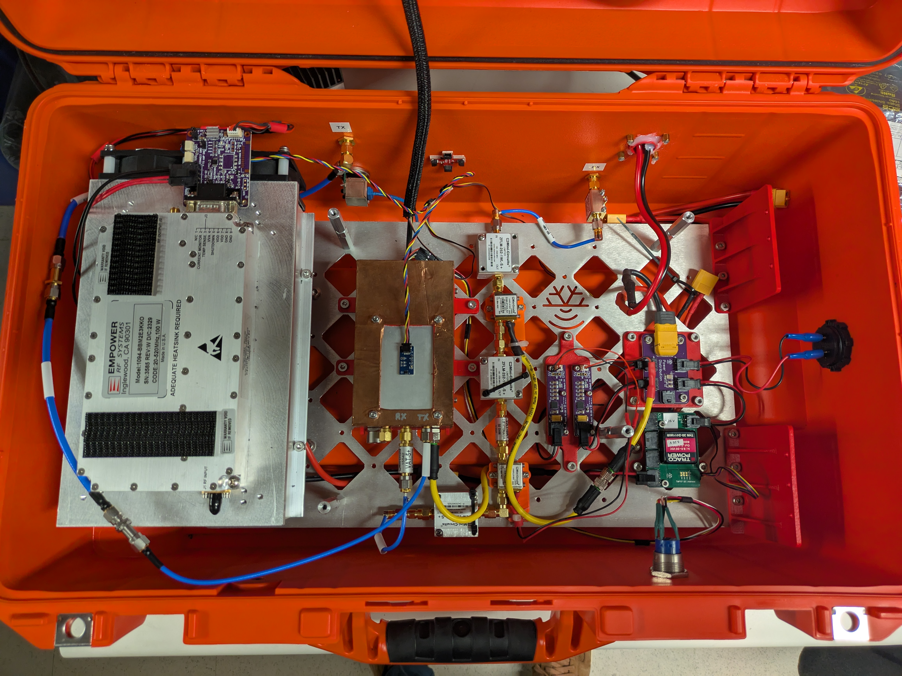

# Battery Power Distribution

**This PCBA is NOT a core Peregrine component. It is part of the "Peregrine+" ground-based system. It may be useful for various customized setups. It should not be used for high current applications such as UAV motors.**

This is a very simple convenience PCB that connects an XT60 connector to 5 Molex Micro-Fit 3 2-pin connectors. It is used to cleanly wire up battery power to several components.

The `.zip` file is an export from EasyEDA. It can be uploaded to EasyEDA as a new project. It is also possible to load in KiCAD using the EasyEDA importer (File > Import Non-KiCad Project ... > EasyEDA (JLCEDA) Std Backup).

The source project in EasyEDA is titled `batt-power-distribution`.

## Fabrication notes

The Gerber files, BOM, and Pick and Place files are in the [fabrication_files](fabrication_files/) subdirectory. I've produced this PCB with JLCPCB in the past, but there's nothing particularly unique about the requirements. Any board house should be able to do it.