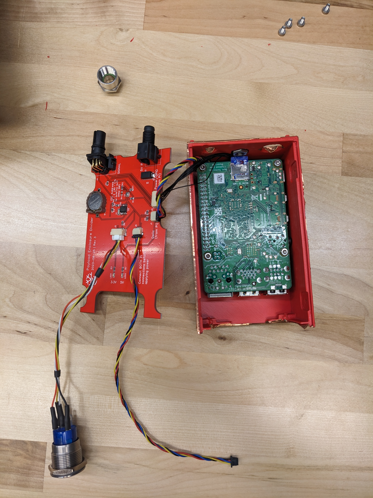
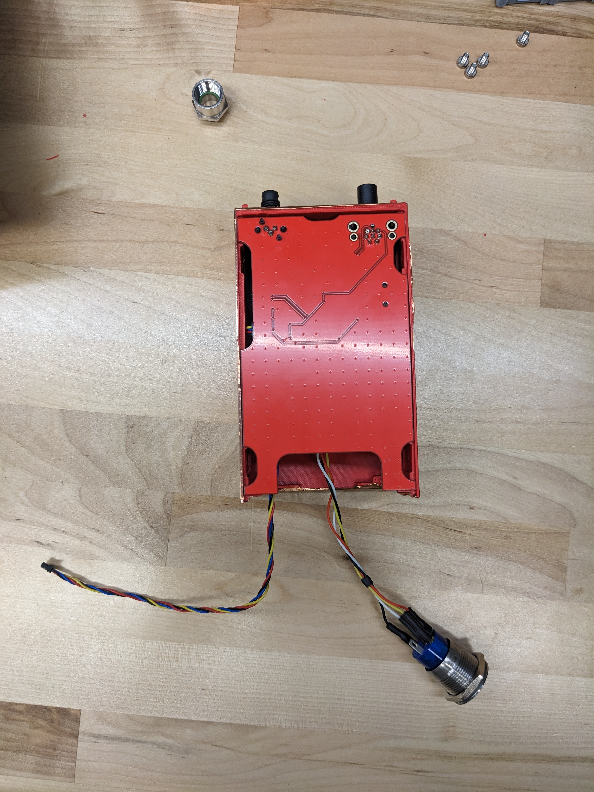

# Peregrine Payload Divider

 

The payload "divider" PCB divides the Raspberry Pi half of the shell from the SDR half of the shell. The PCB physically sits in the middle of the two clamshell pieces, hence its name.

This PCB serves as an external interface to the Pi as well as directly hosting a real-time clock and a temperature sensor. The external connectors to the payload enclosure live on this PCB.

The `.zip` file is an export from EasyEDA. It can be uploaded to EasyEDA as a new project. It is also possible to load in KiCAD using the EasyEDA importer (File > Import Non-KiCad Project ... > EasyEDA (JLCEDA) Std Backup).

The source project in EasyEDA is titled `payload-divider-v4`.

## Fabrication notes

The Gerber files, BOM, and Pick and Place files are in the [fabrication_files](fabrication_files/) subdirectory. I've produced this PCB with JLCPCB in the past, but there's nothing particularly unique about the requirements. Any board house should be able to do it.

For part availability and process reasons, I have never had any of the through-hole parts assembled by JLCPCB, however it should be fine to do so if your PCBA manufacturer has the parts in stock.