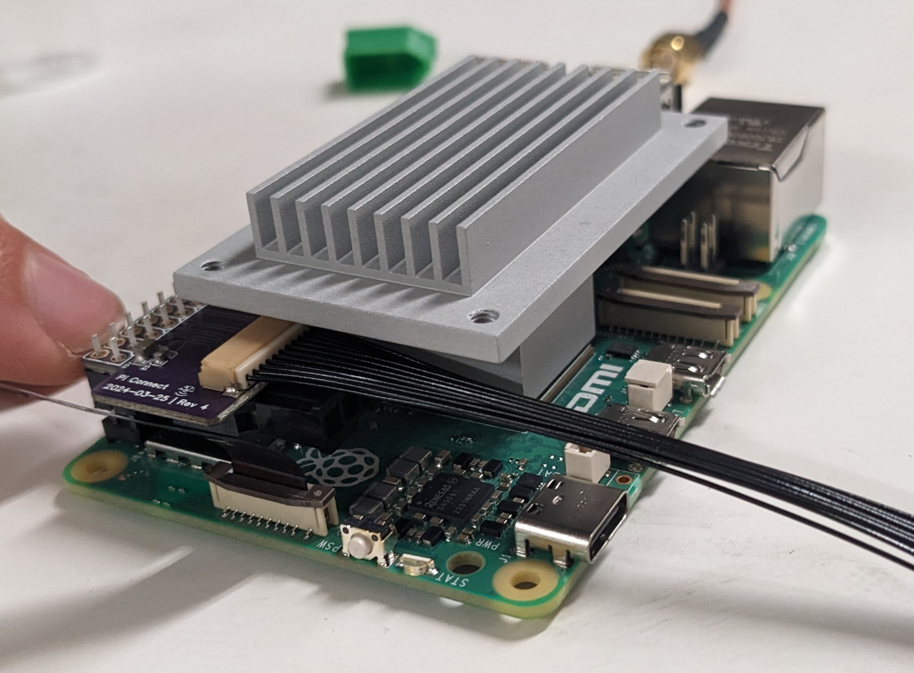

# Peregrine Pi Hat

This is a very small PCB whose only function is to interface with the power and I2C connections on the Pi's GPIO header. It's the purple board on the left of the photo above.

The `.zip` file is an export from EasyEDA. It can be uploaded to EasyEDA as a new project. It is also possible to load in KiCAD using the EasyEDA importer (File > Import Non-KiCad Project ... > EasyEDA (JLCEDA) Std Backup).

The source project in EasyEDA is titled `uav-pi-hat-v4`.

## Production notes

The female header `J1` that connects to the Pi needs to be a low-profile header. The one in the schematic is just a placeholder. I believe that the one I've used is [CES-106-01-L-D](https://www.digikey.com/en/products/detail/samtec-inc/CES-106-01-L-D/6714165). If anyone wants to confirm this part works, I'd appreciate it.

## Design notes

The design is inspired by (but not really otherwise related to) SparkFun's [Qwiic SHIM](https://www.sparkfun.com/sparkfun-qwiic-shim-for-raspberry-pi.html).